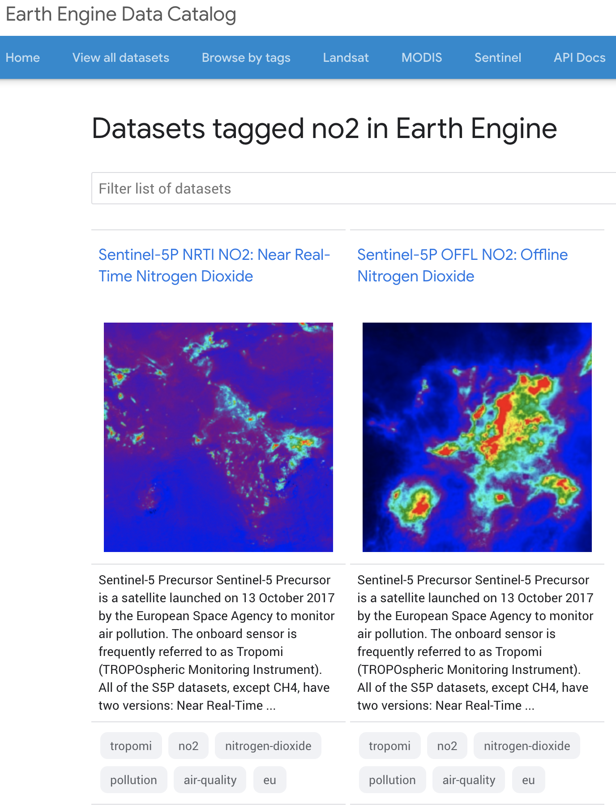
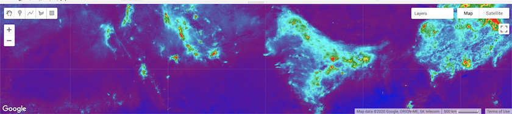
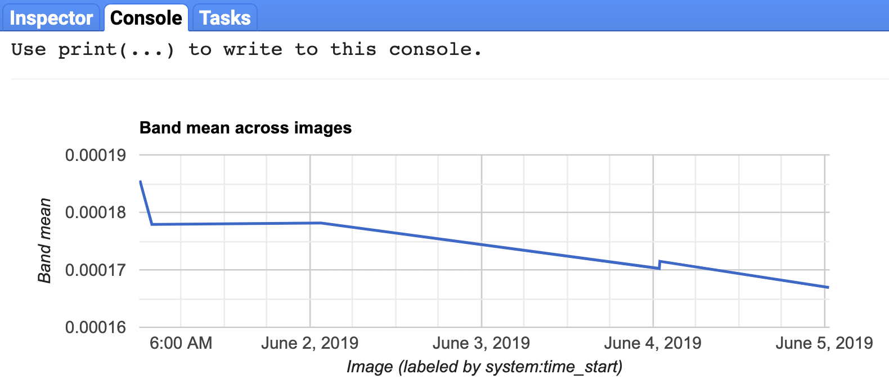
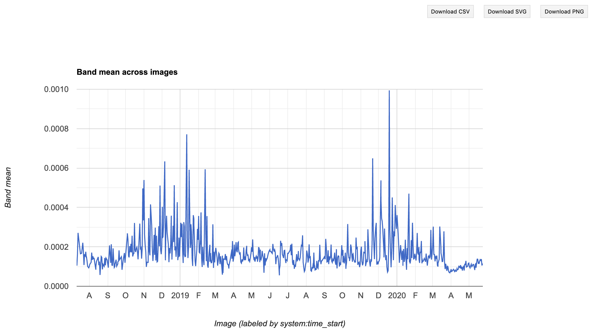

# Satellite

```{r, include=FALSE}
knitr::opts_chunk$set(echo = T, message = F, warning = F)
```

## Objectives {- .objectives}

### Question {-}

- How have emissions related to air quality changed since COVID-19 lockdowns were put in place?

**Background**. Nitrogen dioxide (**NO~2~**) is produced from burning of fossil fuel, especialy from motor vehicles, and contributes to the formation of other air pollutants, including ozone, particulate mattter and acid rain.

### Study area: Delhi, India {-}

- We'll use **Delhi, India** as our initial city study area. Prime Minister Modhi issued a nationwide lockdown on 24 March, 2020. 

**News**:

* [Air pollution falls by unprecedented levels in major global cities during coronavirus lockdowns - CNN](https://www.cnn.com/2020/04/22/world/air-pollution-reduction-cities-coronavirus-intl-hnk/index.html)
* [India: air pollution in the north has hit a 20-year low, NASA report says - CNN](https://www.cnn.com/2020/04/23/india/india-air-pollution-coronavirus-nasa-intl/index.html)
* [Fact Check: Is The COVID-19 Lockdown Decreasing Delhi Air Pollution? - Smart Air Filters](https://smartairfilters.com/en/blog/delhi-pm25-air-pollution-decrease-coronavirus/)

### Learning outcomes {-}

The student will learn how to:

1. Browse Google Earth Engine's data catalogue
1. Examine basic information about the dataset
1. Map datasets in the Code Editor
1. Upload assets, such as a polygon
1. Adjust time period for averaging
1. Generate a time series chart for satellite data extracted to a region 
1. Download data as a text file (csv)

## Prerequisites {- .prereq}

A **Google Earth Engine account** that is associated with a Google account, such as from Gmail, is required to log into https://code.earthengine.google.com.

If you need a GEE account, please visit https://signup.earthengine.google.com.

You may need to log out and back into your web browser as the preferred Google account to request permissions. This approval process can take days to weeks unfortunately.

## Get city boundary

The first step is to define our study area. I made a little R helper function `city2zip()` to:

1. Fetch the administrative boundary from the [Nominatim OpenStreetMap API](https://nominatim.org/release-docs/develop/api/Search/) given a city name.
1. Extract the polygon information, convert to shapefile and zip for upload into GEE.

```{r, eval=F}
source("functions.R")

city2zip("Delhi, India")
```

The function returns the paths to files generated. You will use this zip file to upload into GEE as an asset.

## Browse datasets, tag no2

Visit https://earthengine.google.com > Datasets (upper right). Be sure to explore the many datasets available here.

Since we know we want Nitrogen Dioxide (NO~2~), click on Browse by tags and Filter by "no2". You should see two datasets:



## View dataset info

Please click on "Sentinel-5P NRTI NO2: Near Real-Time Nitrogen Dioxide" to get the dataset view. Explore the metadata for this dataset.

## Questions {.challenge}

1. How many years of data are available?
1. How does this compare with the other "Offline" dataset?
1. Which of the bands do we want to use that is closest to the surface?
1. What are the units of the band "NO2_column_number_density"?
1. What is its maximum value?

### Answers {.solution} 

1. 2018-07-10 - Present, so ~1.5 months shy of 2 years
1. 2018-06-28 - Present, so only ~ 0.5 month longer
1. mol/m^2^
1. 0.0096

## Launch Code Editor with dataset

Scroll to the bottom. You should see the following snippet of JavaScript code:

```js
var collection = ee.ImageCollection('COPERNICUS/S5P/NRTI/L3_NO2')
  .select('NO2_column_number_density')
  .filterDate('2019-06-01', '2019-06-06');

var band_viz = {
  min: 0,
  max: 0.0002,
  palette: ['black', 'blue', 'purple', 'cyan', 'green', 'yellow', 'red']
};

Map.addLayer(collection.mean(), band_viz, 'S5P N02');
Map.setCenter(65.27, 24.11, 4);
```

Click the button at the bottom to launch the Code Editor with this dataset loading JavaScript code:

<a class="btn btn-primary" style="background-color:#1a73e8;color:#fff"
href="https://code.earthengine.google.com/?scriptPath=Examples:Datasets/COPERNICUS_S5P_NRTI_L3_NO2" role="button">Open in Code Editor</a>

## Run the initial dataset script

You should now be seeing the Code Editor. Here are some labels for the user interface to orient yourself:

](images/gee_02_codeeditor.png)

Click **Run** to run the script. Voila! You should see tiles of the satellite data layer appear in the lower Map pane:



Be sure to try out the zoom (+/-) and pan (hand icon) to move around.

## Modify the script so satellite layer is semi-transparent

Decrease the "opacity" (Search for this word under Docs tab; see documentation for Map.addLayer then ee.data.getMapId) in and add the `opacity` parameter with a value of `0.5` to the `band_viz` definition like so (don't forget the extra comma):

```js
var band_viz = {
  min: 0,
  max: 0.0002,
  palette: ['black', 'blue', 'purple', 'cyan', 'green', 'yellow', 'red'],
  opacity: 0.5
};
```

Save the file and Run. I am choosing to save this file as "no2" under the "meds-demo" repository in the Script manager pane (upper left). 

## Add city polygon asset

Use the Asset Manager (Assets tab in upper left) to now add your study area by Uploading a <span style="color: white;background-color: red;">NEW</span> Shape file. Drag `city_Delhi.India.zip` in your file system to the <span style="color: white;background-color: red;">SELECT</span> button. Click <span style="color: white;background-color: rgb(33, 150, 243);">UPLOAD</span> to start upload.

Now click the Tasks tab (upper right) to see that this process is initiated, but not yet complete (spinny gear on right). It should complete within a minute. You might need to refresh your browser for the asset to appear.

Hover over the newly added asset city_Delhi-India in your Assets pane and click on the blue right arrow to import it into your script.

For more on this topic, see [Managing Assets](https://developers.google.com/earth-engine/asset_manager).

## Add to city to map

Notice how it brings in the asset as a default variable named `table`. I suggest changing the name of this variable to something friendlier like `city_ply`, short for city polygon.

Now center the map on this polygon (vs `Map.setCenter(65.27, 24.11, 4);`) and add it as a layer to be drawn on the map:

```js
Map.addLayer(collection.mean(), band_viz, 'S5P N02');
Map.centerObject(city_ply);
Map.addLayer(city_ply, {color: 'black'}, 'Delhi');
```

For more, see:

- [Geometry Visualization and Information](https://developers.google.com/earth-engine/geometry_visualization_info)

## Create time series chart

Next let's generate a [Time Series Chart](https://developers.google.com/earth-engine/charts_image_series), which is available as user interface (`ui`) that we can print (vs embedding in a dedicate [app](https://developers.google.com/earth-engine/apps) or [user interface](https://developers.google.com/earth-engine/ui) -- for another day). 

Its two required parameters are for an image collection and a region (find parameters in the Docs). The third parameter is for the reducer, which is the function that reduces the many pixels into a single value. In our case we want to take the average so we'll use the `ee.Reducer.mean()` function.

```js
print(ui.Chart.image.series(
  collection, 
  city_ply, 
  ee.Reducer.mean()));
```

Save and Run. Yay! You should see a time series chart in the Console:



## Expand dates to all available

But that was only for the default week of '2019-06-01' to '2019-06-06' and we know this dataset is available for a longer period. Let's update `.filterDate()` to use the entire range of available data in line 3:

```js
  .filterDate('2018-07-10', '2020-05-26');
```

Save and Run again. It should take a bit longer to process, since it's now extracting almost 2 years worth of data in the city polygon. Once the plot shows up in the Console again, click the upper right arrow to pop it into its own dedicated window.



## Download CSV

In the popped out window of the time series chart, download the comma-seperated value (CSV) text file by clicking the <span style="color: black;background-color: #F1F1F1;">Download CSV</span> button. I save my file into  `data/no2_gee_Delhi-India.csv` of this Github repository.
 
## Conclusions {-}

It is similarly creating an average raster for the entire time domain of this dataset in the Map pane. Try zooming out, realizing that is happening globally. Now that's big data! In a tiny amount of time, with minor effort.

## Your Turn {.challenge}

- Pick another city and start from the top. Generate a polygon zip, upload as an asset and generate the time series.

## Further Resources {-}

### Google Earth Engine {-}
- [GEE Lessons - GeoHackWeek](https://geohackweek.github.io/GoogleEarthEngine/): Software Carpentry style
- [rgee](https://r-spatial.github.io/rgee/): R package for GEE; still in early development
- [@gorelickGoogleEarthEngine2017a]


