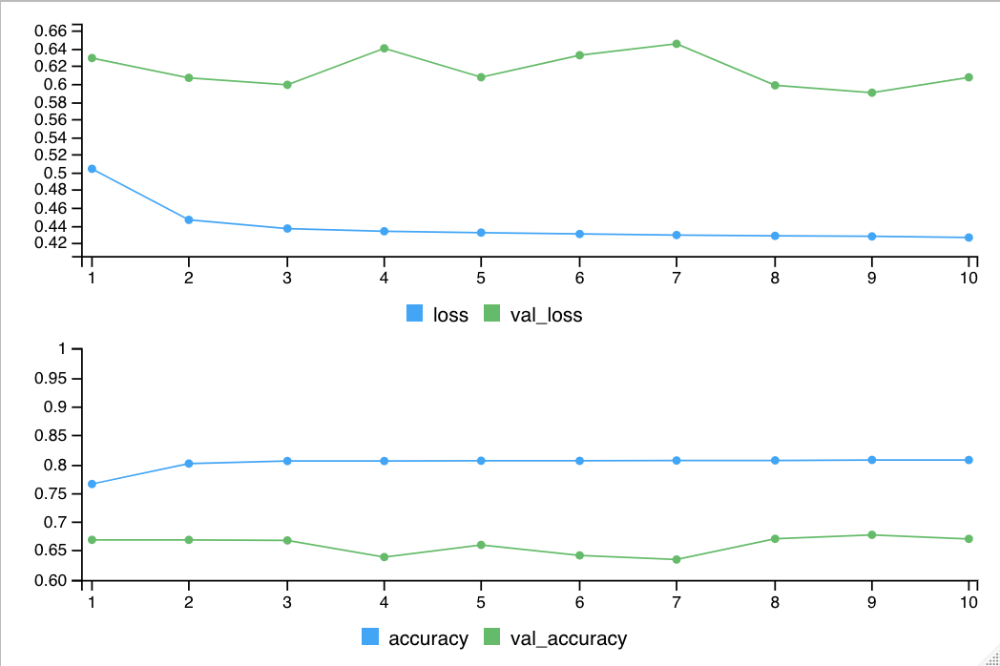
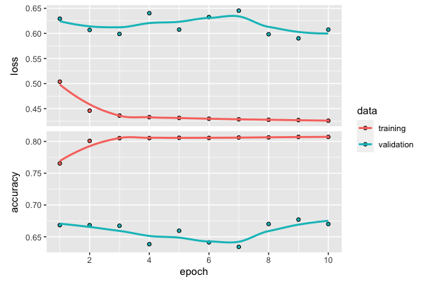

# Sentiment

```{r, include=FALSE}
knitr::opts_chunk$set(echo = T, message = F, warning = F)
```

## Objectives {- .objectives}

### Question {-}

How has sentiment around air quality and clean energy changed since air became cleaner? 

**Background**. In anticipation of the 2008 Summer Olympics in Beijing the Chinese government imposed strict rules to clean up the air. The people got used to better air and now Beijing is consistently improved. Will this hiatus to bad air be temporary or incite a push towards cleaner energy. For a compelling summary, check out the podcast [The Natural Experiment - 99% Invisible](https://99percentinvisible.org/episode/the-natural-experiment/).

### Technical Motivation {-}

Sentiment can be evaluated as either positive or negative. This **binary classification** is the most basic response for **machine learning**, thus a good example for a lesson on machine learning. Text however can have many complicated forms, such as negating terms (eg "happy" vs "_**not**_ happy") and sarcasm ("this air quality is so great! as if."),  which makes it a good candidate for **deep learning**.

### Approach {-}

1. Get tweets about air quality and clean energy throughout the period of the satellite data availability for NO~2~.
1. Lookup tweeted words with a lexicon labelling positive or negative, and tally the score. Bren's own Casey O'Hara & Jessica Couture already explained this approach well in their Eco-Data-Science workshop [Text analysis with R](https://github.com/oharac/text_workshop) (2019-02-05).
1. Use a Twitter dataset pre-labeled with sentiment to train a TensorFlow text classification model. Compare accuracy of TensorFlow model with the lexicon results.
1. Classify twitter sentiment with the TensorFlow model over time for air quality and clean energy..

## Prerequisites {- .prereq}

A **Twitter developer account** is required to download tweets and access the https://developer.twitter.com/en/dashboard. You'll need to apply via the [Twitter developer signup](https://developer.twitter.com/en/apply-for-access).

I recieved an email for clarification and had the account approved and running by the end of the day.

## Load R packages

The `librarian` R package will load packages, installing them if needed, including from Github. 

```{r}
# load libraries ----
# use librarian to load libraries, installing if needed
if (!require("librarian")) install.packages("librarian")
library("librarian")

pkgs <- c(
  # utility
  "here","glue",
  "readr","dplyr","tidyr","purrr","scales",
  "lubridate","stringr",
  # plotting
  "ggplot2","plotly",
  # spatial
  "sf",
  # text
  "rtweet","tidytext","textdata",
  # tensorflow
  "tensorflow","keras")
shelf(pkgs)
```

## Setup Twitter

Start off using the excellent [rtweet](https://rtweet.info) R package to get twitter data. You'll need to setup an access token though after applying for a Twitter developer account. See [Obtaining and using access tokens • rtweet](https://rtweet.info/articles/auth.html) to:

- Create a Twitter App
- Authorization methods
  - 2. Access token/secret method
- Authorization in future R sessions
  ```r
  library(rtweet)
  get_token()
  ```
  
The free Twitter developer API access only goes back 1 week. I upgraded to Premium ($99/month for 50 requests per month) for the Full Archive search going back to Twitter beginnings in 2006. Unfortunately I couldn't get the [`rtweet::search_fullarchive()`](https://rtweet.info/reference/search_fullarchive.html) to return any results. I had to write a custom function `get_tweets_premium()` and added it to [`functions.R`](https://github.com/bbest/meds-demo/blob/master/functions.R).
  
I called the app "clean-air-covid" and developer environment label "research" as well as saved the API key and secret in my home folder under `~/private`.

**IMPORTANT**: Keep the Twitter API 'key' and 'secret' secret. That means that if you are pushing these files to a Github public repository, then you'll need to save these outside the repo, which is why I chose `~/private`.

For more, see:

- [Dev environment — Twitter Developers](https://developer.twitter.com/en/account/environments)
- [Search Tweets - Twitter Developers](https://developer.twitter.com/en/docs/tweets/search/overview)

```{r}
# Twitter API parameters
env_label <- "research"
appname   <- "clean-air-covid"
key       <- readLines("~/private/twitter_clean-air-covid_api-key.txt")
secret    <- readLines("~/private/twitter_clean-air-covid_api-key-secret.txt")
```

## Define queries for air quality and clean energy

These terms were pulled from the following references after a little Google Scholar searching:

- **air quality** [@gurajalaUnderstandingPublicResponse2019]

- **clean energy** [@slubanSentimentLeaningInfluential2015] 

```{r}
query_air    <- "#AIRPOLLUTION OR #AIRQUALITY OR #CLEANAIR OR #HAZE OR #OZONE OR #PARTICLES OR #PARTICULATES OR #PM25 OR #PM2.5 OR #PM10 OR #POLLUTION OR #SMOG OR #EMISSIONS"

query_energy <- "#green OR #cleanenergy OR #renewable OR #renewableenergy OR #sustainable OR #sustainability OR #solar OR #wind OR #solarpower OR #windpower OR #photovoltaic OR #biomass OR #biofuel OR #biofuels"

queries <- list(air = query_air, energy = query_energy)
```

Note: Twitter searches are not case-sensitive.

## Define spatial and temporal extent

Let's get the spatial and temporal extents from our previous satellite analysis:

- **Spatial**. Let's get the centroid from the city's polygon boundary (`data/city_delhi.geojson`) and use the maximum radius (25 miles) for Twitter searches.

- **Temporal**. Let's get tweets for the same timespan as the downloaded CSV of NO~2~ satellite data (`data/no2_delhi_ee-chart.csv`).

```{r}
library(sf)
library(lubridate)

# variables & files
loc_name <- "delhi"
city_geo <- here(glue("data/city_{loc_name}.geojson"))
no2_csv  <- here(glue("data/no2_{loc_name}_ee-chart.csv"))

# spatial
loc_lonlat    <- read_sf(city_geo) %>% 
  st_drop_geometry() %>% 
  select(lon, lat) %>% 
  as.numeric()
loc_radius_mi <- 25 # max radius for tweet point_radius search

# temporal
date_range <- read_csv(no2_csv) %>% 
  mutate(
    date = mdy(`system:time_start`)) %>% 
  pull(date) %>% 
  range()
date_months <- seq(floor_date(date_range[1], unit = "month"), date_range[2], by = "months")
range(date_months)
```

## Get tweets, iterating over queries & months

Let's now iterate over each query (`query_air` and `query_energy`) and each month over our temporal period of interest (`date_range`).

```{r}
# define: get_tweets_premium(), clean_tweet()
source(here("functions.R")) 

tweets_all_csv <- here(glue('data/tweets_{loc_name}.csv'))

n_queries <- length(names(queries))
n_months  <- length(date_months)

if (!file.exists(tweets_all_csv)){
  
  dir_tweets <- here("data/tweets")
  dir.create(dir_tweets, showWarnings = F)

  # iterate over queries
  for (i_query in seq_along(names(queries))){ # i_query = 1
    
    query_name <- names(queries)[i_query]
    query      <- queries[[query_name]]
    message(glue("query {i_query}/{n_queries} {query_name}: {query}"))
    
    # iterate over temporal range by month
    for (i_month in seq_along(date_months)){ # i_month = 23
      
      date_beg <- date_months[i_month]
      date_end <- date_beg + months(1)
      ym_beg   <- format(date_beg, "%Y-%m")
      
      tweets_csv <- here(glue('{dir_tweets}/tweets_{loc_name}_{query_name}_{ym_beg}.csv'))
      
      if (file.exists(tweets_csv)) next
      
      message(glue("  month {i_month}/{n_months} {date_beg}: {basename(tweets_csv)}"))
      
      tbl <- get_tweets_premium(
        env_label, appname, key, secret, query,
        date_beg, date_end, loc_lonlat, loc_radius_mi,
        tweets_csv)
    }
  }
  
  # read tweets into table
  regexp <- "tweets_([a-z]+)_([a-z]+)_([0-9-]+).csv"
  tweets <- tibble(
    csv = list.files(here("data/tweets"), full.names = T)) %>% 
    mutate(
      loc_name   = str_replace(basename(csv), regexp, "\\1"),
      query_name = str_replace(basename(csv), regexp, "\\2"),
      ym_str     = str_replace(basename(csv), regexp, "\\3"),
      ym_date    = as.Date(glue("{ym_str}-01")),
      data       = map(csv, read_csv),
      n_tweets   = map_int(data, nrow)) %>% 
    unnest(data)
  
  write_csv(tweets, tweets_all_csv)
} else {
  tweets <- read_csv(tweets_all_csv)
}

g <- tweets %>%
  group_by(query_name, ym_date, n_tweets) %>% 
  summarize() %>% 
  rename(query = query_name) %>% 
  ggplot(
    aes(x = ym_date, y = n_tweets, color = query)) +
  geom_line()
ggplotly(g)
```

## Classify sentiment of tweets over time, using lexicon

Now let's borrow from [Text analysis with R](https://github.com/oharac/text_workshop) (2019-02-05), created by Bren's own Casey O'Hara & Jessica Couture as an [Eco-Data-Science](https://eco-data-science.github.io/) workshop, to use get a sentiment score based on a lexicon, or dictionary of words with assigned sentiment assigned.

```{r}
lex_bing <- get_sentiments('bing')

# clean out non-ascii, twitter handles, and urls
tweets <- tweets %>% 
  mutate(
    text_clean = clean_tweet(text))

# tweets to words
words <- tweets %>% 
  select(id, created_at, user_name, text_clean) %>% 
  unnest_tokens(output = word, input = text_clean, token = "words") %>% 
  anti_join(stop_words, by = "word") %>% 
  left_join(lex_bing, by = "word") %>% 
  left_join(
    tribble(
      ~sentiment, ~lex_score,
      "positive", 1,
      "negative", -1),
    by = "sentiment")

# tally lex_score per tweet
tweets <- tweets %>% 
  left_join(
    words %>% 
      group_by(id) %>% 
      summarize(
        lex_score = mean(lex_score, na.rm = T)),
    by = "id")

# tally lex_score per month
months <- tweets %>% 
  group_by(query_name, ym_date) %>% 
  summarize(lex_score = mean(lex_score, na.rm = T))

g <- months %>%
  rename(query = query_name) %>% 
  ggplot(
    aes(x = ym_date, y = lex_score, color = query)) +
  geom_line()
ggplotly(g)
```

## Twitter Sentiment140 dataset

[For Academics - Sentiment140 - A Twitter Sentiment Analysis Tool](http://help.sentiment140.com/for-students)

```{r}
# web link to download dataset and folder in which to store
s140_url <- "http://cs.stanford.edu/people/alecmgo/trainingandtestdata.zip"
s140_dir <- here("data/sentiment140")

# download and unzip sentiment140 data
if (length(list.files(s140_dir)) < 2){
  s140_zip <- glue("{s140_dir}/{basename(s140_url)}")
  dir.create(s140_dir, showWarnings = F)
  download.file(s140_url, s140_zip)
  unzip(s140_zip, exdir = s140_dir)
  unlink(s140_zip)
}

# get training and test files
test_csv  <- list.files(s140_dir, "^test.*", full.names = T)

# read in testing dataset
# polarity: convert negative 0 -> -1, neutral 2 -> 0, positive 4 -> 1  
s140_cols <- c("polarity", "id", "created_at", "query", "screen_name", "text")
test <- read_csv(test_csv, col_names = s140_cols) %>% 
  mutate(
    polarity   = recode(polarity, `0` = -1, `2` = 0, `4` = 1),
    text_clean = clean_tweet(text))

# test tweets to words
test_words <- test %>% 
  select(id, created_at, screen_name, text_clean) %>% 
  unnest_tokens(output = word, input = text_clean, token = "words") %>% 
  anti_join(stop_words, by = "word") %>% 
  left_join(lex_bing, by = "word") %>% 
  left_join(
    tribble(
      ~sentiment, ~lex_score,
      "positive",  1,
      "negative", -1),
    by = "sentiment")

# tally lex_score per tweet
test <- test %>% 
  left_join(
    test_words %>% 
      group_by(id) %>% 
      summarize(
        lex_score = mean(lex_score, na.rm = T)),
    by = "id")

hist(test$lex_score)

# performance
test <- test %>% 
  mutate(
    lex_accurate = case_when(
      polarity == -1 & lex_score < 0 ~ T,
      polarity ==  0 & lex_score == 0 ~ T,
      polarity ==  1 & lex_score > 0 ~ T,
      T ~ F))
#select(test, polarity, lex_score, lex_accurate, text_clean)
sum(test$lex_accurate) / nrow(test)
```

## Train TensorFlow model with Sentiment140

Now we'll train a deep learning model on the Sentiment140 dataset before using to classify the tweets.

This will follow the [Text Classification | TensorFlow for R](https://tensorflow.rstudio.com/tutorials/beginners/basic-ml/tutorial_basic_text_classification/) example, except we'll be using the Sentiment140 dataset from Twitter instead of the IMDB movie review dataset.

The text of the tweets must be converted to tensors before fed into the neural network. First, we create a dictionary and represent each of the 10,000 most common words by an integer. In this case, every tweet will be represented by a sequence of integers.

NOTE: I am unable to knit this Rmarkdown file to html when running tensorflow non-interactively, so the following chunks were run manually in RStudio and set to `eval=F` to render this web page. Outputs have been roughly replicated below R chunks.

```{r, eval=F}
train_csv  <- list.files(s140_dir, "^train.*", full.names = T)

# load training dataset only if needed since large
train <- read_csv(train_csv, col_names = s140_cols) %>% 
mutate(
  polarity   = recode(polarity, `0` = -1, `2` = 0, `4` = 1),
  text_clean = clean_tweet(text))

# examine labels in training dataset
train %>% count(polarity)
```

```
# A tibble: 2 x 2
  polarity      n
     <dbl>  <int>
1       -1 800000
2        1 800000
```

```{r, eval=F}
# create padded arrays
num_words  <- 10000
max_length <- 50
text_vectorization <- layer_text_vectorization(
  max_tokens = num_words, 
  output_sequence_length = max_length)

# adapt the text vectorization layer 
#   to learn about unique words in our dataset 
#   and assign an integer value for each one
text_vectorization %>% 
  adapt(train$text_clean)

# check out the first 20 words
get_vocabulary(text_vectorization) %>% head(20)
```

```
usr
i
to
the
a
my
and
you
is
it
for
in
of
im
on
me
so
have
that
but
```

```{r, eval=F}
# check out how the text vectorization layer transforms it’s inputs
text_vectorization(matrix(train$text_clean[1], ncol = 1))
```

```
tf.Tensor(
[[   2   41  464  105    6 1217    9 3496   51  872    1   14 1875   33
     4   43   11  449    0    0    0    0    0    0    0    0    0    0
     0    0    0    0    0    0    0    0    0    0    0    0    0    0
     0    0    0    0    0    0    0    0]], shape=(1, 50), dtype=int64)
```

```{r, eval=F}
# build the model by stacking layers
input <- layer_input(shape = c(1), dtype = "string")

# input data consists of an array of word-indices
# labels to predict are either -1 or 1
output <- input %>% 
  text_vectorization() %>% 
  layer_embedding(input_dim = num_words + 1, output_dim = 16) %>%
  layer_global_average_pooling_1d() %>%
  layer_dense(units = 16, activation = "relu") %>%
  layer_dropout(0.5) %>% 
  layer_dense(units = 1, activation = "sigmoid")

model <- keras_model(input, output)

# configure the model to use an optimizer and a loss function
model %>% compile(
  optimizer = 'adam',
  loss = 'binary_crossentropy',
  metrics = list('accuracy'))

summary(model)
```

```
Model: "model"
___________________________________________________________
Layer (type)              Output Shape            Param #  
===========================================================
input_1 (InputLayer)      [(None, 1)]             0        
___________________________________________________________
text_vectorization (TextV (None, 50)              0        
___________________________________________________________
embedding (Embedding)     (None, 50, 16)          160016   
___________________________________________________________
global_average_pooling1d  (None, 16)              0        
___________________________________________________________
dense (Dense)             (None, 16)              272      
___________________________________________________________
dropout (Dropout)         (None, 16)              0        
___________________________________________________________
dense_1 (Dense)           (None, 1)               17       
===========================================================
Total params: 160,305
Trainable params: 160,305
Non-trainable params: 0
___________________________________________________________
```

```{r, eval=F}
# train the model
history <- model %>% fit(
  train$text_clean,
  as.numeric(train$polarity == 1),
  epochs = 10,
  batch_size = 512,
  validation_split = 0.2,
  verbose=2)
```

RStudio Console output during model fitting:
```
Epoch 1/10
2500/2500 - 12s - loss: 0.5038 - accuracy: 0.7653
2500/2500 - 14s - loss: 0.5038 - accuracy: 0.7653 - val_loss: 0.6292 - val_accuracy: 0.6683
Epoch 2/10
2500/2500 - 12s - loss: 0.4460 - accuracy: 0.8008
2500/2500 - 14s - loss: 0.4460 - accuracy: 0.8008 - val_loss: 0.6068 - val_accuracy: 0.6683
Epoch 3/10
2500/2500 - 12s - loss: 0.4362 - accuracy: 0.8052
2500/2500 - 13s - loss: 0.4362 - accuracy: 0.8052 - val_loss: 0.5989 - val_accuracy: 0.6673
Epoch 4/10
2500/2500 - 12s - loss: 0.4331 - accuracy: 0.8052
2500/2500 - 14s - loss: 0.4331 - accuracy: 0.8052 - val_loss: 0.6402 - val_accuracy: 0.6384
Epoch 5/10
2500/2500 - 12s - loss: 0.4316 - accuracy: 0.8057
2500/2500 - 14s - loss: 0.4316 - accuracy: 0.8057 - val_loss: 0.6075 - val_accuracy: 0.6595
Epoch 6/10
2500/2500 - 12s - loss: 0.4300 - accuracy: 0.8055
2500/2500 - 14s - loss: 0.4300 - accuracy: 0.8055 - val_loss: 0.6324 - val_accuracy: 0.6413
Epoch 7/10
2500/2500 - 12s - loss: 0.4288 - accuracy: 0.8061
2500/2500 - 14s - loss: 0.4288 - accuracy: 0.8061 - val_loss: 0.6453 - val_accuracy: 0.6341
Epoch 8/10
2500/2500 - 12s - loss: 0.4279 - accuracy: 0.8063
2500/2500 - 13s - loss: 0.4279 - accuracy: 0.8063 - val_loss: 0.5983 - val_accuracy: 0.6701
Epoch 9/10
2500/2500 - 12s - loss: 0.4273 - accuracy: 0.8071
2500/2500 - 14s - loss: 0.4273 - accuracy: 0.8071 - val_loss: 0.5900 - val_accuracy: 0.6770
Epoch 10/10
2500/2500 - 12s - loss: 0.4260 - accuracy: 0.8070
2500/2500 - 14s - loss: 0.4260 - accuracy: 0.8070 - val_loss: 0.6074 - val_accuracy: 0.6700
```

RStudio Viewer output during model fitting:



```{r, eval=F}
# model accuracy and loss over iterations
plot(history)
```



```{r, eval=F}
# evaluate the model
tf_score <- predict(model, test$text_clean)[,1] %>% 
  rescale(c(-1, 1))

# performance
test <- test %>% 
  mutate(
    tf_score = tf_score,
    tf_accurate = case_when(
      polarity == -1 & tf_score < -0.1 ~ T,
      polarity ==  0 & tf_score > -0.1 & tf_score < 0.1 ~ T,
      polarity ==  1 & tf_score >  0.1 ~ T,
      T ~ F))

#select(test, polarity, tf_score, tf_accurate, text_clean)
sum(test$tf_accurate) / nrow(test)
```

```
[1] 0.5763052
```

## Classify sentiment of tweets over time, using TensorFlow

Now that we've trained the TensorFlow model, we can classify the tweets using this model.

```{r}
sentiments_csv <- here(glue("data/sentiments_{loc_name}.csv"))

if (!file.exists(sentiments_csv)){

  # predict with model
  tweets <- tweets %>% 
    mutate(
      tf_score = predict(model, tweets$text_clean)[,1] %>% 
        rescale(c(-1, 1)))
  
  # tally score per month
  months <- tweets %>% 
    group_by(query_name, ym_date) %>% 
    summarize(tf_score = mean(tf_score, na.rm = T))
  
  # save monthly results
  write_csv(months, sentiments_csv)
}
months <- read_csv(sentiments_csv)

g <- months %>%
  rename(query = query_name) %>% 
  ggplot(
    aes(x = ym_date, y = tf_score, color = query)) +
  geom_line()
ggplotly(g)
```

