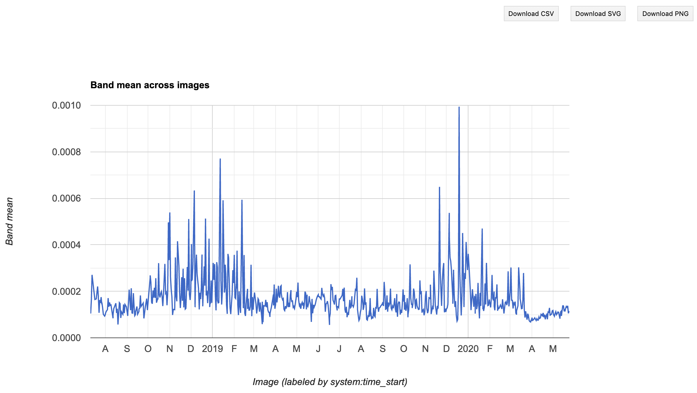

--- 
title: "Clean Air in the Time of COVID"
subtitle: "Use Cases for Google Earth Engine & Sentiment Analysis"
author: "Ben Best, PhD"
date: "`r Sys.Date()`"
site: bookdown::bookdown_site
output: bookdown::gitbook
documentclass: book
bibliography: [style/zotero_meds-demo.bib, style/packages.bib]
biblio-style: apalike
link-citations: yes
github-repo: bbest/meds-demo
description: "These materials are for a 45 minute teaching demonstration oriented towards students in the new Masters in Environmental Data Science at UCSB."
---

```{r include=F, eval=F}
# create bibliography database for R packages
knitr::write_bib(c(
  .packages(), 'bookdown', 'knitr', 'rmarkdown'
), 'style/packages.bib')
```


```{r include=F}
knitr::opts_chunk$set(echo = TRUE)
```

# Overview {-}

These materials are for a 45 minute teaching demonstration on 2020-05-26 oriented towards students in the new Masters in Environmental Data Science at UCSB.

## Motivation {- .objectives}

This is an exciting time for the emerging field of Environmental Data Science. Environmental problems are increasingly complex and require advanced technical skills to translate the ever expanding flow of data into actionable insights.

### Technologies {-}

The two specific technologies featured in this teaching demonstration highlight some of the most promising aspects of truly :

- **Google Earth Engine** leverages the massive storage and computational capabilities of the Google Cloud to analyze petabytes of the publicly available satellite data. For instance, global climatologies averaging across 40 years of temperature can be calculated and mapped in seconds. This is a truly _big data_ platform!

- **TensorFlow** is the machine learning software made open-source by Google. It is the most commonly used software for audio, text and image analysis. More specifically tensorflow allows construction of _convolutional neural networks_, which represent a layering of nodes to enable complex pattern matching. These _deep learning_ models have been popularized by their ability to beat the best human at the most complex game of Go, self-drive vehicles and respond to your beck and call through Alexa's voice commands.

### Motivating Use Case {-}

<blockquote class="twitter-tweet"><p lang="en" dir="ltr">For the first time in decades, Mount Everest was visible from Kathmandu due to improved air quality.</p>
<p>
<a href="https://t.co/n4kLw1OwcW"></a>
</p>
&mdash; Tom Patterson (\@MtnMapper) <a href="https://twitter.com/MtnMapper/status/1263487780799184897?ref_src=twsrc%5Etfw">May 21, 2020</a></blockquote> <script async src="https://platform.twitter.com/widgets.js" charset="utf-8"></script>

<blockquote class="twitter-tweet"><p lang="en" dir="ltr">The positive effect of the Lockdown in India’s environment can be seen in New Delhi.<br>This picture depicts the air quality of New Delhi before &amp; after Lockdown.<br>Source - <a href="https://t.co/VoG0UbpFzE">https://t.co/VoG0UbpFzE</a></p>
<p>
<a href="https://t.co/FKlz93coJr"></a>
</p>
&mdash; GurumaujSatsangi (\@GurumaujS) <a href="https://twitter.com/GurumaujS/status/1253244126239379457?ref_src=twsrc%5Etfw">April 23, 2020</a></blockquote> <script async src="https://platform.twitter.com/widgets.js" charset="utf-8"></script>


## Prerequisites {- .prereq}

See the Setup for required software. For this demonstration to make the most sense, it's preferable that you're familiar with:

- **R**
- **GIS**

<!--chapter:end:index.Rmd-->

# Setup {-}

## Install software

This workshop will require the following software installed on your machine:

- [R](http://cran.cnr.berkeley.edu/)
- [RStudio](https://www.rstudio.com/products/rstudio/download/#download)

Please download the appropriate stable release for your operating system.

## Launch RStudio

RStudio is an integrated development environment (IDE) for editing text in the code editor, running commands in the R console, viewing defined objects in the workspace and past commands in the history, and viewing plots, files and help. Here's a layout of the panes in RStudio, each of which can have several tabs for alternate functionality:


Check out the Help > Cheatsheets > [RStudio IDE Cheat Sheet](https://github.com/rstudio/cheatsheets/raw/master/rstudio-ide.pdf).

## Fork and Clone the Github Repository

Please visit https://github.com/bbest/meds-demo, signed into Github. Then  into your own writable user space.

Here is the Github repository of the source files for this demonstration:

https://github.com/bbest/meds-demo

You are encouraged to [fork the repo in Github](https://help.github.com/en/github/getting-started-with-github/fork-a-repo) and [clone it in RStudio](https://happygitwithr.com/rstudio-git-github.html#clone-the-new-github-repository-to-your-computer-via-rstudio).

Then you can follow along in RStudio by evaluating the chunks of R code, while referencing the website:

http://benbestphd.com/meds-demo


## Install R Packages

Here's a bit of code to install packages that we'll use throughout the workshop. Please copy and paste this code into your console.

```{r, message=F, warning=F}
# use librarian to load libraries, installing if needed
if (!require("librarian")) install.packages("librarian")
library("librarian")

# load packages
pkgs <- c(
  # general
  "tidyverse","jsonlite","glue","here","units",

  # satellite
  "sf",
  
  # sentiment
  "rtweet","tidytext")
shelf(pkgs)

# report on versions of software & packages
sessionInfo()
```

## Create Rmarkdown file

Rmarkdown is a dynamic document format that allows you to knit chunks of R code with formatted text (aka markdown). We recommend that you use this format for keeping a reproducible research document as you work through the lessons To get started, File > New File > Rmarkdown... and go with default HTML document and give any title you like (default "Untitled" or "test" or "First Rmd" is fine).

Check out the Help > Markdown Quick Reference and Help > Cheatsheets > [R Markdown Cheat Sheet](https://github.com/rstudio/cheatsheets/raw/master/rmarkdown-2.0.pdf).

Here's a 1 minute video on the awesomeness of Rmarkdown:

```{r, echo=F}
vembedr::embed_url("https://vimeo.com/178485416")
```


<!--chapter:end:00_setup.Rmd-->

# Satellite

```{r setup, include=FALSE}
knitr::opts_chunk$set(echo = T, message = F, warning = F)
```


## Objectives {- .objectives}

### Question {-}

- How have emissions related to air quality changed since COVID-19 lockdowns were put in place? 

### Study area: Delhi, India {-}

- We'll use **Delhi, India** as our initial city study area. Prime Minister Modhi issued a nationwide lockdown on 24 March, 2020. 

**News**:

* [Air pollution falls by unprecedented levels in major global cities during coronavirus lockdowns - CNN](https://www.cnn.com/2020/04/22/world/air-pollution-reduction-cities-coronavirus-intl-hnk/index.html)
* [India: air pollution in the north has hit a 20-year low, NASA report says - CNN](https://www.cnn.com/2020/04/23/india/india-air-pollution-coronavirus-nasa-intl/index.html)
* [Fact Check: Is The COVID-19 Lockdown Decreasing Delhi Air Pollution? - Smart Air Filters](https://smartairfilters.com/en/blog/delhi-pm25-air-pollution-decrease-coronavirus/)

### Learning outcomes {-}

1. Browse Google Earth Engine's data catalogue
1. Map satellite imagery dataset layer
1. Filter by date
1. Average values over time
1. Upload a polygon into assets
1. Use polygon to extract values for study area
1. Average values in space within the polygon
1. Generate a time series chart for satellite data 
1. Download data as a text file (csv)

## Prerequisites {- .prereq}

A **Google Earth Engine account** that is associated with a Google account, such as from Gmail, is required to log into https://code.earthengine.google.com.

If you need a GEE account, please visit https://signup.earthengine.google.com.

You may need to log out and back into your web browser as the preferred Google account to request permissions. This approval process can take days to weeks unfortunately.

## Get city boundary

The first step is to define our study area. I made a little R helper function `city2zip()` to:

1. Fetch the administrative boundary from the [Nominatim OpenStreetMap API](https://nominatim.org/release-docs/develop/api/Search/) given a city name.
1. Extract the polygon information, convert to shapefile and zip for upload into GEE.

```{r, eval=F}
source("functions.R")

city2zip("Delhi, India")
```

The function returns the paths to files generated. You will use this zip file to upload into GEE as an asset.

## Browse datasets, tag no2

Visit https://earthengine.google.com > Datasets (upper right). Be sure to explore the many datasets available here.

Since we know we want Nitrogen Dioxide (NO~2~), click on Browse by tags and Filter by "no2". You should see two datasets:


## View dataset info

Please click on "Sentinel-5P NRTI NO2: Near Real-Time Nitrogen Dioxide" to get the dataset view. Explore the metadata for this dataset.

## Questions {.challenge}

1. How many years of data are available?
1. How does this compare with the other "Offline" dataset?
1. Which of the bands do we want to use that is closest to the surface?
1. What are the units of the band "NO2_column_number_density"?
1. What is its maximum value?

### Answers {.solution} 

1. 2018-07-10 - Present, so ~1.5 months shy of 2 years
1. 2018-06-28 - Present, so only ~ 0.5 month longer
1. mol/m^2^
1. 0.0096

## Launch Code Editor with dataset

Scroll to the bottom. You should see the following snippet of JavaScript code:

```js
var collection = ee.ImageCollection('COPERNICUS/S5P/NRTI/L3_NO2')
  .select('NO2_column_number_density')
  .filterDate('2019-06-01', '2019-06-06');

var band_viz = {
  min: 0,
  max: 0.0002,
  palette: ['black', 'blue', 'purple', 'cyan', 'green', 'yellow', 'red']
};

Map.addLayer(collection.mean(), band_viz, 'S5P N02');
Map.setCenter(65.27, 24.11, 4);
```

Click the button at the bottom to launch the Code Editor with this dataset loading JavaScript code:

<a class="btn btn-primary" style="background-color:#1a73e8;color:#fff"
href="https://code.earthengine.google.com/?scriptPath=Examples:Datasets/COPERNICUS_S5P_NRTI_L3_NO2" role="button">Open in Code Editor</a>

## Run the initial dataset script

You should now be seeing the Code Editor. Here are some labels for the user interface to orient yourself:

](https://geohackweek.github.io/GoogleEarthEngine/fig/02_codeeditor.png)

Click **Run** to run the script. Voila! You should see tiles of the satellite data layer appear in the lower Map pane:


Be sure to try out the zoom (+/-) and pan (hand icon) to move around.

## Modify the script so satellite layer is semi-transparent

Decrease the "opacity" (Search for this word under Docs tab; see documentation for Map.addLayer then ee.data.getMapId) in and add the `opacity` parameter with a value of `0.5` to the `band_viz` definition like so (don't forget the extra comma):

```js
var band_viz = {
  min: 0,
  max: 0.0002,
  palette: ['black', 'blue', 'purple', 'cyan', 'green', 'yellow', 'red'],
  opacity: 0.5
};
```

Save the file and Run. I am choosing to save this file as "no2" under the "meds-demo" repository in the Script manager pane (upper left). 

## Add city polygon asset

Use the Asset Manager (Assets tab in upper left) to now add your study area by Uploading a <span style="color: white;background-color: red;">NEW</span> Shape file. Drag `city_Delhi.India.zip` in your file system to the <span style="color: white;background-color: red;">SELECT</span> button. Click <span style="color: white;background-color: rgb(33, 150, 243);">UPLOAD</span> to start upload.

Now click the Tasks tab (upper right) to see that this process is initiated, but not yet complete (spinny gear on right). It should complete within a minute. You might need to refresh your browser for the asset to appear.

Hover over the newly added asset city_Delhi-India in your Assets pane and click on the blue right arrow to import it into your script.

For more on this topic, see [Managing Assets](https://developers.google.com/earth-engine/asset_manager).

## Add to city to map

Notice how it brings in the asset as a default variable named `table`. I suggest changing the name of this variable to something friendlier like `city_ply`, short for city polygon.

Now center the map on this polygon (vs `Map.setCenter(65.27, 24.11, 4);`) and add it as a layer to be drawn on the map:

```js
Map.addLayer(collection.mean(), band_viz, 'S5P N02');
Map.centerObject(city_ply);
Map.addLayer(city_ply, {color: 'black'}, 'Delhi');
```

For more, see:

- [Geometry Visualization and Information](https://developers.google.com/earth-engine/geometry_visualization_info)

## Create time series chart

Next let's generate a [Time Series Chart](https://developers.google.com/earth-engine/charts_image_series), which is available as user interface (`ui`) that we can print (vs embedding in a whole user interface -- for another day). 

Its two required parameters are for an image collection and a region (find parameters in the Docs). The third parameter is for the reducer, which is the function that reduces the many pixels into a single value. In our case we want to take the average so we'll use the `ee.Reducer.mean()` function.

```js
print(ui.Chart.image.series(
  collection, 
  city_ply, 
  ee.Reducer.mean()));
```

Save and Run. Yay! You should see a time series chart in the Console:


## Expand dates to all available

But that was only for the default week of '2019-06-01' to '2019-06-06' and we know this dataset is available for a longer period. Let's update `.filterDate()` to use the entire range of available data in line 3:

```js
  .filterDate('2018-07-10', '2020-05-26');
```

Save and Run again. It should take a bit longer to process, since it's now extracting almost 2 years worth of data in the city polygon. Once the plot shows up in the Console again, click the upper right arrow to pop it into its own dedicated window.



## Download CSV

In the popped out window of the time series chart, download the comma-seperated value (CSV) text file by clicking the <span style="color: black;background-color: #F1F1F1;">Download CSV</span> button. I save my file into  `data/no2_gee_Delhi-India.csv` of this Github repository.
 
## Conclusions {-}

It is similarly creating an average raster for the entire time domain of this dataset in the Map pane. Try zooming out, realizing that is happening globally. Now that's big data! In a tiny amount of time, with minor effort.

## Further Resources {-}

### Google Earth Engine {-}
- [GEE Lessons - GeoHackWeek](https://geohackweek.github.io/GoogleEarthEngine/): Software Carpentry style
- [rgee](https://r-spatial.github.io/rgee/): R package for GEE; still in early development
- [@gorelickGoogleEarthEngine2017a]


<!--chapter:end:01_satellite.Rmd-->


# Sentiment

## Twitter Examples

["air quality" - Twitter Search / Twitter](https://twitter.com/search?q=%22air%20quality%22&src=typed_query)


```{r echo=FALSE}
blogdown::shortcode('tweet', '1263487780799184897')
```

## Authenticate Twitter

[Obtaining and using access tokens • rtweet](https://rtweet.info/articles/auth.html):

- Creating a Twitter App
- Authorization methods
  - 2. Access token/secret method
- Authorization in future R sessions
  ```r
  library(rtweet)
  get_token()
  ```
  
## Enable Google Geocoding

TODO: switch to OpenStreetMap API, for radius too

To obtain an API key and enable services, go to https://cloud.google.com/maps-platform/. [as ben@ecoquants.com]

- Create project "meds-gee"
- [Maps APIs and Servi… – Google Maps – meds-gee – Google Cloud Platform](https://console.cloud.google.com/google/maps-apis/new?authuser=1&project=meds-gee&folder=&organizationId=)
- APIs sidebar. Click Geocoding API. Enable.
- Credentials sidebar. + CREATE CREDENTIALS -> API key
- Saved to `~/private/google_meds-gee_api-key.txt`

``` {r, eval=F}
# load libraries ----
# use librarian to load libraries, installing if needed
if (!require("librarian")) install.packages("librarian")
library("librarian")

pkgs <- c(
  # utility
  "here","glue","stringr","dplyr","readr",
  # airquality
  "ropensci/ropenaq",
  # spatial
  "ggmap","mapview","leaflet",
  # text
  "rtweet","textdata","tidytext",
  # tensorflow
  "tensorflow","keras","tfhub","rstudio/tfds")
shelf(pkgs)

# variables ----
q          <- '"air quality"'
city       <- "Delhi, India"
city_r     <- "15mi"

q_s        <- str_remove_all(q, '[ ,"]')
city_s     <- str_replace(city, ", ", "+")
city_geo   <- glue("data/city_{city_s}.geojson")
#cities_csv <- glue("data/city_{loc_s}.csv")
tweets_rds <- glue("data/tweets_{q_s}_{city_s}.rds")
#tbl_rds <- glue("data/tweets_{qloc}.csv")
#d_csv  <- "data/tweets_air-quality.csv"
gkey       <- "~/private/google_meds-gee_api-key.txt"

# get location lon/lat from place name
if (!file.exists(loc_csv)){
  register_google(key = readLines(gkey))

  loc_xy <- geocode(loc)
  stopifnot(nrow(loc_xy) == 1)
  
  write_as_csv(loc_xy, loc_csv)
}
loc_xy  <- read_csv(loc_csv)
loc_xyr <- glue("{loc_xy$lat},{loc_xy$lon},{loc_r}")

if (!file.exists(tbl_rds)){
  tbl <- search_tweets(
    q, n = 1000, 
    geocode = loc_xyr)

  saveRDS(tbl, tbl_rds)
}
tbl <- readRDS(tbl_rds)
```


```{r, eval = F}
s_b <- get_sentiments('bing')
s_a <- get_sentiments('afinn')
s_n <- get_sentiments('nrc')

tbl <- tbl %>% 
  mutate(
    text_clean = text %>% 
      str_replace_all("[^[:ascii:]]", "_") %>% 
      tolower() %>% 
      str_replace_all("@[^ ]+", "_usr_") %>% 
      str_replace_all("http[^ ]+", "_url_"))
# tbl %>% select(created_at, screen_name, text, text_clean) %>% View()

df <- tbl %>% 
  select(status_id, created_at, screen_name, text_clean) %>% 
  unnest_tokens(output = word, input = text_clean, token = "words") %>% 
  anti_join(stop_words, by = "word") %>% 
  left_join(s_b, by = "word")
```

## city osm poly

```{r, eval = F}
source("functions.R")

if (!file.exists(city_geo))
  city2geo(city_s, city_geo)
city_ply <- read_sf(city_geo)
write_sf(city_ply, "data/city_delhi/delhi.shp")


# https://developers.google.com/earth-engine/charts_image_series
mapview(city_ply)
```


## openaq

- API: https://docs.openaq.org/#api-Measurements-GetMeasurements

- [ropenaq](https://docs.ropensci.org/ropenaq/): Accesses Air Quality Data from the Open Data Platform OpenAQ

```{r, eval = F}
library(ropenaq)
library(tidyr)

cities_table <- aq_cities() %>% 
  filter(str_detect(city,"Delhi"))

aq_cities() %>% 
  filter(str_detect(city,"Delhi"))

city_locs <- aq_locations(country = "IN", city = "Delhi") %>% 
  filter(no2, pm25) %>% 
  arrange(desc(count))
View(city_locs)


loc_d <- city_locs %>% 
  select(-count) %>% 
  unnest(countsByMeasurement) %>% 
  filter(
    parameter == "no2",
    date(lastUpdated) > now() %>% date() - days(1)) %>% 
  arrange(desc(count)) %>% 
  slice(1)

loc <- loc_d$location
loc <- loc_d$location %>% str_replace_all(" ", "+")

city_loc_d <- city_locs %>% 
  filter(location == loc)

city_loc_d %>% View()

city_locs %>% 
  filter(location == loc) %>% 
  View()

m_no2 <- aq_measurements(country = "IN", city = "Delhi", parameter = "no2")
range(as_date(m_no2$dateUTC)) # "2019-12-12" "2020-05-23"
attr(m_no2, "meta") # limit: 10,000;  found: 1,162,354

m_no2 <- aq_measurements(
  latitude  = loc_d$latitude, longitude = loc_d$longitude, radius    = "10",
  parameter = "no2", page = 1) %>% 
  bind_rows(
    aq_measurements(
      latitude  = loc_d$latitude, longitude = loc_d$longitude, radius    = "100",
      parameter = "no2", page = 2)) %>% 
  bind_rows(
    aq_measurements(
      latitude  = loc_d$latitude, longitude = loc_d$longitude, radius    = "100",
      parameter = "no2", page = 3)) %>% 
  bind_rows(
    aq_measurements(
      latitude  = loc_d$latitude, longitude = loc_d$longitude, radius    = "100",
      parameter = "no2", page = 4))
range(as_date(m_no2$dateUTC)) # "2019-12-12" "2020-05-23"
attr(m_no2, "meta") # limit: 10,000;  found: 35,069

m1 <- aq_measurements(
      latitude  = loc_d$latitude, longitude = loc_d$longitude, radius    = "100",
      parameter = "no2", page = 1)
range(as_date(m1$dateUTC)) # "2020-02-24" "2020-05-23"
attr(m1, "meta") # limit: 10,000;  found: 35,069

m2 <- aq_measurements(
      latitude  = loc_d$latitude, longitude = loc_d$longitude, radius    = "100",
      parameter = "no2", page = 2)
range(as_date(m2$dateUTC)) # 
attr(m2, "meta") # limit: 10,000;  found:

location <- https://api.openaq.org/v1/locations

q_loc <- loc_d$location %>% str_replace_all(" ", "+")
q_loc
fromJSON(glue("https://api.openaq.org/v1/locations?location={q_loc}"))
openaq
https://api.openaq.org/v1/measurements?location=Shadipur%2C%2BDelhi%2B-%2BCPCB&parameter=no2

https://api.openaq.org/v1/locations/IN-88
https://api.openaq.org/v1/locations?location=Shadipur,+Delhi+-+CPCB
https://api.openaq.org/v1/measurements?location=Shadipur,+Delhi+-+CPCB&parameter=no2

library(httr)

m_url <- "https://api.openaq.org/v1/measurements"

json_url <- glue("https://api.openaq.org/v1/measurements?location={q_loc}&parameter=no2&limit=1&format=json")
x <- GET(
    m_url, 
    query = list(
      location  = loc_d$location,
      parameter = "no2",
      format    = "json",
      limit     = 1))
meta <- content(x, "text") %>% fromJSON() %>% .$meta

n_max   <- 10000
n_pages <- ceiling(meta$found/n_max)
for (i in 1:pages){ # i = 2
  date_beg <- loc_d$firstUpdated %>% as_date() %>% as.character()
  date_end <- loc_d$firstUpdated + days(60)
  date_end <- as_date(date_end) %>% as.character()

  date_beg <- date("2018-01-01") 
  date_end <- date_beg + months(1)

  x <- GET(
    m_url, 
    query = list(
      #location  = loc_d$location,
      coordinates = with(city_ply, glue("{round(lat,2)},{round(lon,2)}")),
      #radius      = 2500, # default
      radius      = 1000000, # default
      parameter   = "no2",
      format      = "csv",
      #format    = "json",
      date_from   = date_beg,
      date_to     = date_end,
      #limit       = n_max,
      limit       = 5,
      page        = i))
  x$url
  #if (http_type(x) != "application/json")
  #  stop("API did not return json", call. = F)
  #cat(content(x, "text")) # {"statusCode":404,"error":"Not Found"}
  # no2 unit: µg/m³
  
  #y <- fromJSON(content(x, "text"))
  
  y <- read_csv(content(x, "text"))
  y
  
  y %>% 
    select(dtime_utc = utc, no2_mgm3 = value) %>% 
    write_csv("data/aq_delhi_no2.csv", append = ifelse(i != 1, T, F))
  # 6636
}


d <- read_csv(url)

 %>%   .$results
tbl <- res$results %>% as_tibble()
names(tbl)
tbl %>% 
  select(parameter, date_utc = tbl$date$)
names(res$results)
m_no2_a <- aq_measurements(
  country = "IN", city = "Delhi", parameter = "no2", 
  attribution = T, averaging_period = T, source_name = T)

aq_locations(country = "IN", city = "Delhi")
m_no2_loc <- aq_measurements(
  #country = "IN", city = "Delhi", location = "Shadipur, New Delhi - CPCB", 
  #country = "IN", city = "Delhi", location = loc, 
  #location = "DTU, Delhi - CPCB", 
  location = "DTU,+Delhi+-+CPCB", 
  #country = "IN", city = "Delhi", location = "IN-88", 
  parameter = "no2")
range(as_date(m_no2_loc$dateUTC)) # 
attr(m_no2_loc, "meta") # limit: 10,000;  found: 

aq_measurements

tmp <- aq_measurements(country="IN", city="Delhi", location="Anand+Vihar", parameter="pm25")

coordinates, radius
date_from
date_to

m_pm25 <- aq_measurements(country = "IN", city = "Delhi", parameter = "pm25")
attr(m, "meta")
# limit: 10,000;  found: 1,141,521

range(as_date(m_pm25$dateUTC)) # "2019-12-12" "2020-05-23"
#, limit = 10, page = 1)
kable(results_table)
```


## aqicn.org

Downloaded from:
- [Air Quality Historical Data Platform](https://aqicn.org/data-platform/register/)


[aqicn.org/city/delhi](https://aqicn.org/city/delhi/) - Delhi Air Pollution: Real-time Air Quality Index; daily avg of this station:
- Anand Vihar, Delhi
sources:
- Delhi Pollution Control Commitee (Government of NCT of Delhi)
- CPCB - India Central Pollution Control Board

TODO:

- [Beijing Air Pollution: Real-time Air Quality Index](https://aqicn.org/city/beijing/)
- [COVID-19 Worldwide Air Quality data](https://aqicn.org/data-platform/covid19/)
  - 380 major cities in the world, from January 2020 until now.
  

The CSV data sets can be downloaded programatically: The url is

https://aqicn.org/data-platform/covid19/report/14286-3d64290c/period

Where period is any of 2019Q1, 2019Q2, 2019Q3, 2019Q4, 2018H1, 2017H1, 2016H1, 2015H1.

For instance using curl:
curl --compressed -o waqi-covid-2020.csv   https://aqicn.org/data-platform/covid19/report/14286-3d64290c/2020
curl --compressed -o waqi-covid-2019Q1.csv https://aqicn.org/data-platform/covid19/report/14286-3d64290c/2019Q1
curl --compressed -o waqi-covid-2019Q2.csv https://aqicn.org/data-platform/covid19/report/14286-3d64290c/2019Q2
curl --compressed -o waqi-covid-2019Q3.csv https://aqicn.org/data-platform/covid19/report/14286-3d64290c/2019Q3
curl --compressed -o waqi-covid-2019Q4.csv https://aqicn.org/data-platform/covid19/report/14286-3d64290c/2019Q4
curl --compressed -o waqi-covid-2018H1.csv https://aqicn.org/data-platform/covid19/report/14286-3d64290c/2018H1
curl --compressed -o waqi-covid-2017H1.csv https://aqicn.org/data-platform/covid19/report/14286-3d64290c/2017H1
curl --compressed -o waqi-covid-2016H1.csv https://aqicn.org/data-platform/covid19/report/14286-3d64290c/2016H1
curl --compressed -o waqi-covid-2015H1.csv https://aqicn.org/data-platform/covid19/report/14286-3d64290c/2015H1
To download the list of stations with latitude, longitude and EPA feed:
curl --compressed -o airquality-covid19-cities.json https://aqicn.org/data-platform/covid19/airquality-covid19-cities.json


```{r, eval = F}
library(dygraphs)
library(lubridate)
library(xts)

#d <- read_csv("data/new-delhi us embassy, india-air-quality.csv") %>% 
d <- read_csv("data/anand-vihar, delhi, delhi, india-air-quality.csv") %>% 
  mutate(
    date = as_date(date))
d
# date        pm25  pm10    o3   no2   so2    co
#View(d)
range(d$date)
#range(d$jday)
d <- d %>% 
  mutate(
    jday = yday(date))

# calculate climatology
d_c <- d %>% 
  group_by(jday) %>% 
  summarise(no2_clim = mean(no2, na.rm = T)) %>% 
  ungroup() 

# show in time
d_y <- expand_grid(
  year = min(year(d$date)):year(now()), 
  jday = 1:365) %>% 
  mutate(
    date = date(glue("{year}-01-01")) + days(jday - 1)) %>% 
  left_join(d_c, by = "jday") %>% 
  filter(date <= date(now()))

d_y2 <- d_y %>% 
  select(date, no2_clim) %>% 
  left_join(
    d %>% 
      select(date, no2),
    by = "date")

#x <- xts(x = d$pm25, order.by = d$date)
x <- xts(x = select(d_y2, -date), order.by = pull(d_y2, date))
dygraph(x) %>% 
  dyRangeSelector()
```

Next steps: weekly / monthly average

- [RPubs - Beijing PM 2.5 Line Charts 2017/01 to 2018/03](https://rpubs.com/ceshine/beijing_pm25_201701_201803)
## search full archive

Setup dev env:

- [Dev environments — Twitter Developers](https://developer.twitter.com/en/account/environments)


```{r, eval = F}
beg <- "2020-05-20"
end <- "2020-05-23"

tbl <- search_fullarchive(
  q,
  n = 100,
  fromDate = beg,
  toDate = end,
  env_name = "research")

  # safedir = NULL,
  # parse = TRUE,
  # token = NULL
  # point_radius:[lon lat radius])

table(as.Date(tbl$created_at))
ts_plot(tbl)


    
    fromDate, toDate,
/search/fullarchive/:label.json

```


TODO:

1. get sentiment per tweet by tallying negative & positive
1. join back to tweets
1. get over time

## TensorFlow

- datasets to train on:
  - Sentiment140
  - `dictionary.txt` in [Sentiment analysis for text with Deep Learning - Towards Data Science](https://towardsdatascience.com/sentiment-analysis-for-text-with-deep-learning-2f0a0c6472b5) from https://nlp.stanford.edu/sentiment/
  
  - [Sentiment analysis 👍 👎 on Twitter using Word2vec and Keras | Ahmed BESBES](https://www.ahmedbesbes.com/blog/sentiment-analysis-with-keras-and-word-2-vec):
  "The dataset can be downloaded from this [link](https://drive.google.com/uc?id=0B04GJPshIjmPRnZManQwWEdTZjg&export=download). It's a csv file that contains **1.6 million rows**. Each row has amongst other things the text of the tweet and the corresponding sentiment.

- [covid-twitter-bert | TensorFlow Hub](https://tfhub.dev/digitalepidemiologylab/covid-twitter-bert/1)

- [Sentiment140 dataset with 1.6 million tweets | Kaggle](https://www.kaggle.com/kazanova/sentiment140)

- http://help.sentiment140.com/
  Sentiment140 allows you to discover the sentiment of a brand, product, or topic on Twitter.
  - http://cs.stanford.edu/people/alecmgo/trainingandtestdata.zip
  


## tfhub

[RStudio AI Blog: tfhub: R interface to TensorFlow Hub](https://blogs.rstudio.com/ai/posts/2019-12-18-tfhub-0.7.0/)

you need to install the Python packages once:

```{r, eval=F}
tensorflow::install_tensorflow()
keras::install_keras()
tfhub::install_tfhub()
tfds::install_tfds()
reticulate::py_config()
```

```{r, eval = F}
library(tfhub)
library(keras)

layer_mobilenet <- layer_hub(
  handle = "https://tfhub.dev/google/tf2-preview/mobilenet_v2/classification/4")

input <- layer_input(shape = c(224, 224, 3))
output <- layer_mobilenet(input)
model <- keras_model(input, output)
summary(model)
```

```{rv}, eval = Fimg <- image_load("data/grace-hopper.jpg", target_size = c(224,224)) %>% 
  image_to_array()
img <- img/255
dim(img) <- c(1, dim(img))
pred <- predict(model, img)
imagenet_decode_predictions(pred[,-1,drop=FALSE])[[1]]
```
``

<!--chapter:end:02_sentiment.Rmd-->

